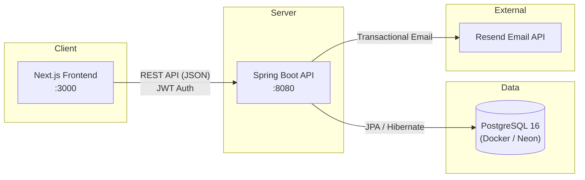
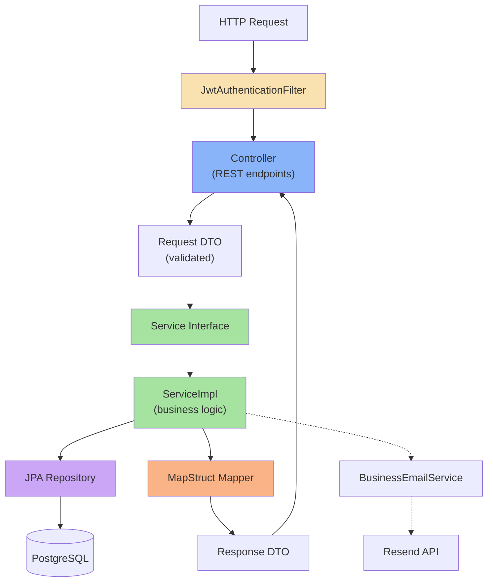
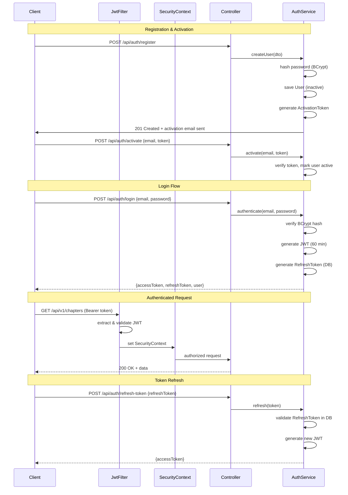
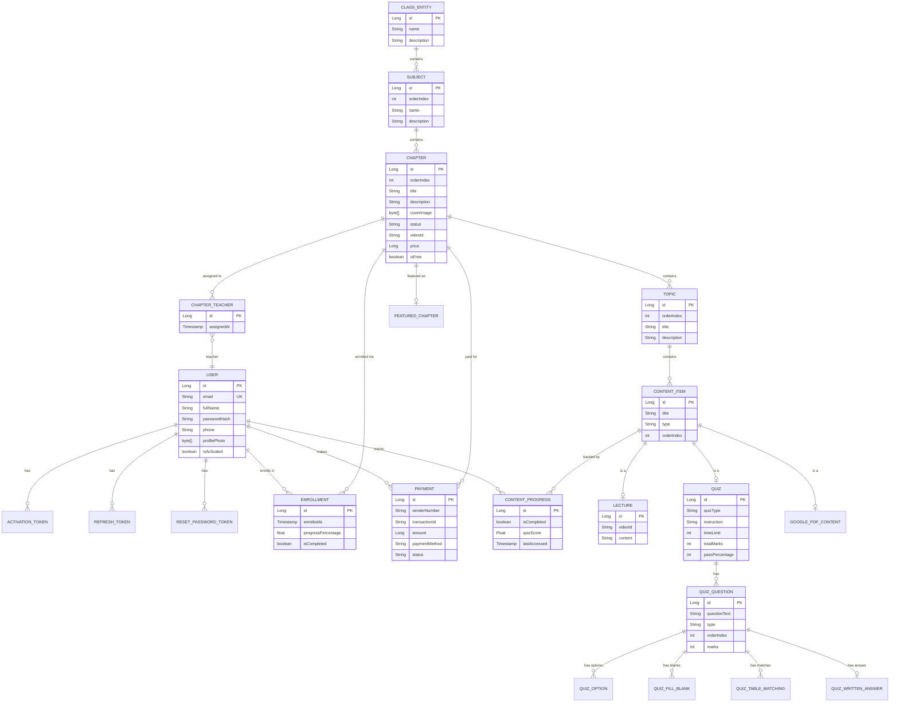
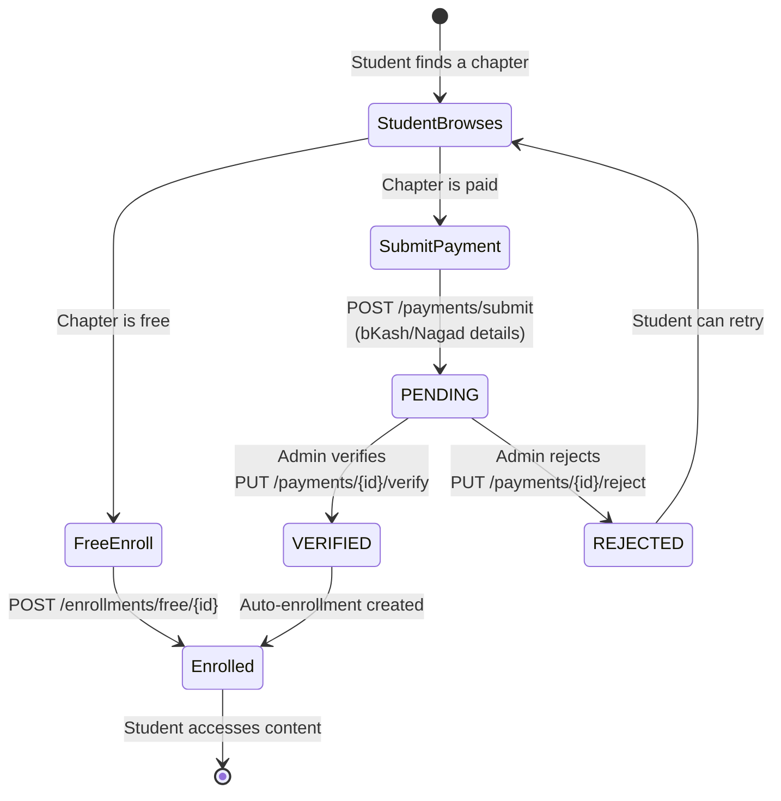

# Montola School — Backend Architecture

> This document provides architectural context for AI coding assistants and developers onboarding to the project.

---

## System Overview

Montola School is a 2-tier web application with a separate frontend and backend:



- **Frontend** → Next.js 16 at `:3000` — consumes REST API
- **Backend** → Spring Boot 3.5.5 at `:8080` — serves JSON API
- **Database** → PostgreSQL 16 — local Docker (dev) or Neon cloud (prod)
- **Email** → Resend API — activation, password reset, purchase confirmation

---

## Layered Architecture

The backend follows a **layered architecture** within each domain package:



**Flow**: HTTP → JWT Filter → Controller → Service (interface) → ServiceImpl → Repository → Database

Each layer has a clear responsibility:

| Layer | Responsibility | Location |
|-------|---------------|----------|
| **Filter** | JWT authentication, whitelist bypass | `common/security/JwtAuthenticationFilter` |
| **Controller** | HTTP endpoint mapping, request validation, authorization | `*/controller/` |
| **DTO** | Data transfer between layers, request/response shaping | `*/dto/` |
| **Service** | Business logic interface | `*/service/*.java` (interface) |
| **ServiceImpl** | Business logic implementation | `*/service/impl/*.java` |
| **Repository** | Data access (Spring Data JPA) | `*/repository/` |
| **Mapper** | Entity ↔ DTO conversion (MapStruct) | `*/mapper/` |
| **Model** | JPA entities | `*/model/` |

---

## Domain Package Structure

The codebase uses **domain-driven packaging** — code is organized by business domain, not by technical layer:

```mermaid
graph TD
    ROOT["com.montola.school"] --> ADMIN["admin/"]
    ROOT --> AUTH["auth/"]
    ROOT --> COMMON["common/"]
    ROOT --> COURSE["course/"]
    ROOT --> LEARNER["learner/"]
    ROOT --> PAYMENT["payment/"]

    ADMIN --> A1["controller/"]
    ADMIN --> A2["dto/"]
    ADMIN --> A3["service/"]

    AUTH --> B1["controller/ — AuthController, UserController"]
    AUTH --> B2["dto/ — 11 DTOs"]
    AUTH --> B3["enums/ — Role"]
    AUTH --> B4["model/ — User, tokens"]
    AUTH --> B5["repository/"]
    AUTH --> B6["security/ — UserDetails"]
    AUTH --> B7["service/"]

    COMMON --> C1["config/ — Security, OpenAPI, Resend"]
    COMMON --> C2["exception/ — 11 exceptions + GlobalHandler"]
    COMMON --> C3["model/ — Persistent base entity"]
    COMMON --> C4["security/ — JWT filter, service, properties"]

    COURSE --> D1["controller/ — 7 controllers"]
    COURSE --> D2["dto/ — 36 DTOs"]
    COURSE --> D3["model/ — 7 entities + content subtypes"]
    COURSE --> D4["repository/ — 15 repositories"]
    COURSE --> D5["service/ — 12 services"]

    LEARNER --> E1["controller/ — ProgressController"]
    LEARNER --> E2["model/ — Enrollment, ContentProgress"]

    PAYMENT --> F1["controller/ — Payment, FreeEnrollment"]
    PAYMENT --> F2["model/ — Payment"]
```



| Package | Responsibility |
|---------|---------------|
| `admin` | Admin dashboard statistics |
| `auth` | User registration, login, JWT tokens, password management, profile pictures |
| `common` | Shared infrastructure — security config, exception handling, base entity, email service |
| `course` | Course content management — classes, subjects, chapters, topics, content items (lectures/quizzes/PDFs), teacher assignments, featured chapters |
| `learner` | Student enrollment and progress tracking |
| `payment` | Payment submission, verification, and free enrollment |
| `shop` | Shop catalog (products, bundles), entitlements, shop payments, admin management |
| `care` | Academic Care enquiry lead capture and follow-up |
| `notice` | Homepage notices |

---

## Authentication & Authorization Flow



### Authorization Layers

1. **URL-level whitelisting** — Public endpoints bypass JWT filter entirely (`SecurityProperties.whitelist`)
2. **JWT filter** — Validates token, extracts user, sets `SecurityContext`
3. **Method-level** — `@PreAuthorize("hasRole('ADMIN')")` on controller methods
4. **Business-level** — `ChapterAuthorizationService` checks teacher-chapter assignment

### Role Hierarchy

```
ADMIN ─── Full access to everything
MANAGER ── Same as Admin (shares admin dashboard)
TEACHER ── Edit assigned chapters, topics, content only
STUDENT ── View purchased/free content, track progress
```

Users can hold **multiple roles** simultaneously.

---

## Entity Relationship Diagram



---

## Course Content Hierarchy

```
Class (e.g., "Class 6")
 └── Subject (e.g., "Mathematics")
      └── Chapter (e.g., "Algebra Basics") ← purchasable unit
           ├── Cover Image
           ├── Price / Free flag
           ├── Status: DRAFT → PUBLISHED → ARCHIVED
           ├── Assigned Teachers (ChapterTeacher join)
           └── Topic (e.g., "Variables and Constants")
                └── ContentItem (ordered within topic)
                     ├── LECTURE — video ID + rich text content
                     ├── QUIZ — MCQ, fill-blank, matching, written
                     └── PDF — Google Drive file reference
```

**Key points:**
- **Chapter** is the purchasable unit (not class or subject)
- Content is accessed **sequentially** — students must complete previous content first
- Teachers are **assigned** to specific chapters and can only edit their assigned chapters
- Chapters can be **free** (no payment required) or **paid**

---

## Payment Flow



Payment methods: **bKash** and **Nagad** (Bangladeshi mobile payment services). Verification is **manual** by admin/manager.

---

## Database Strategy

| Aspect | Dev | Prod |
|--------|-----|------|
| Provider | Docker PostgreSQL 16 | Neon (cloud PostgreSQL) |
| Connection | `localhost:5432/montola` | `DB_URL` with SSL |
| Schema Management | Hibernate `validate` | Flyway migrations |
| Flyway | Enabled (baselined at V12 for pre-existing DBs) | Enabled |
| Pool | Default | HikariCP (max 5) |

### Flyway Migrations

Organized in versioned folders:

```
db/migration/
├── init/                  # V1–V7: Core schema
│   ├── V1__users.sql
│   ├── V2__activation_tokens_and_reset_password.sql
│   ├── V3__courses.sql
│   ├── V4__contents.sql
│   ├── V5__chapter_teacher.sql
│   ├── V6__payments.sql
│   └── V7__content_progress.sql
├── 2026.1.1/              # V8–V11: Feature additions
│   ├── V8__update_enrollment_and_user.sql
│   ├── V9__add_refresh_token_table.sql
│   ├── V10__add_chapter_cover_image.sql
│   └── V11__featured_chapters.sql
└── 2026.3.1/              # V12: Schema refinement
    └── V12__add_primary_keys.sql
```

The shop/care/notice modules add a fourth folder:

```
db/migration/2026.4.1/
├── V13__levels.sql                          # Levels (JSC/SSC/HSC) + classes.level_id
├── V14__shop_products.sql                   # Shop products
├── V15__shop_bundles.sql                    # Bundles + bundle_products join
├── V16__shop_entitlements_and_payments.sql  # Entitlements + shop payments
├── V17__care_leads.sql                      # Academic Care leads
└── V18__notices.sql                         # Notices
```

---

## Base Entity (`Persistent`)

All domain entities extend `Persistent` (MappedSuperclass), which provides:

| Field | Type | Purpose |
|-------|------|---------|
| `version` | `@Version Long` | Optimistic locking |
| `createdAt` | `LocalDateTime` | Auto-set on creation |
| `updatedAt` | `LocalDateTime` | Auto-set on update |
| `isDeleted` | `boolean` | Soft delete flag (default: `false`) |

---

## Exception Handling

All exceptions flow through `GlobalExceptionHandler` which returns standardized `ErrorResponse`:

```json
{
  "status": 404,
  "message": "Chapter not found",
  "timestamp": "2026-05-29T14:30:00",
  "fieldErrors": null
}
```

Custom exceptions: `ResourceNotFoundException`, `ResourceAlreadyExistsException`, `TokenExpiredException`, `TokenMissingException`, `RegistrationTokenExpiredException`, `UserNotActivatedException`, `ChapterNotAuthorizedException`, `InvalidContentTypeException`, `InvalidQuizTypeException`, `ContentAccessDeniedException`, `SequentialAccessException`.

---

## External Integrations

| Service | Library | Purpose |
|---------|---------|---------|
| **Resend** | `resend-java:2.0.0` | Transactional emails (activation, password reset, purchase confirmation) |
| **Google Drive** | URL reference only | PDF content storage (fileId stored, rendered via Google Docs viewer) |
| **AWS S3** | `software.amazon.awssdk:s3` | Shop product files. Private bucket, short-lived presigned URLs, behind `FileStorageService`. Optional — the default `external` provider keeps a supplied reference instead. |

Emails are sent from `Montola School <noreply@montolaschool.com>` with HTML templates embedded in `BusinessEmailService`.
